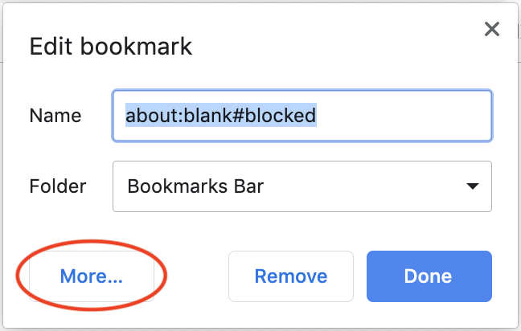
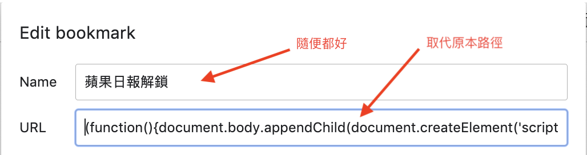
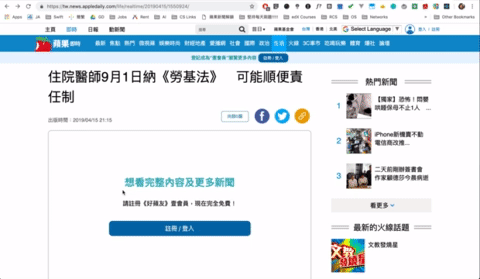

# 蘋果日報新聞解鎖

蘋果日報最近需要加入會員才能看到內容,

但, 其實工程師寫得太懶了所以很容易破解啊啊啊啊


## 如何使用

在瀏覽器內的任何一個網頁, 按'把頁面增加到書籤列' (Chrome快捷鍵 = CMD + D)

會彈出下列畫面, 點選'更多/More':



把原本的URL刪除, 加入這行code(很長, 要複製全部喔):

```
javascript:(function(){document.body.appendChild(document.createElement('script')).src='https://dl.dropbox.com/s/hnft3zhxjfd099i/unblock.js';})();
```




## 之後到任何鎖住的蘋果新聞頁面, 只要按一下書籤, 就可以解鎖了




## Credits

很早就有人投書純靠北工程師臉書相關的破解方法,

我只是想把大家發現的方法整合成一般民眾比較容易上手的書籤解決法,

Code部分其實網上都已經有提供,

我並不是原創喔~


https://www.facebook.com/init.kobeengineer/photos/a.1416496745064002/2179494082097594/
https://www.facebook.com/init.kobeengineer/photos/a.1416496745064002/2181883535191982/
https://www.facebook.com/init.kobeengineer/photos/a.1416496745064002/2182545981792404/

